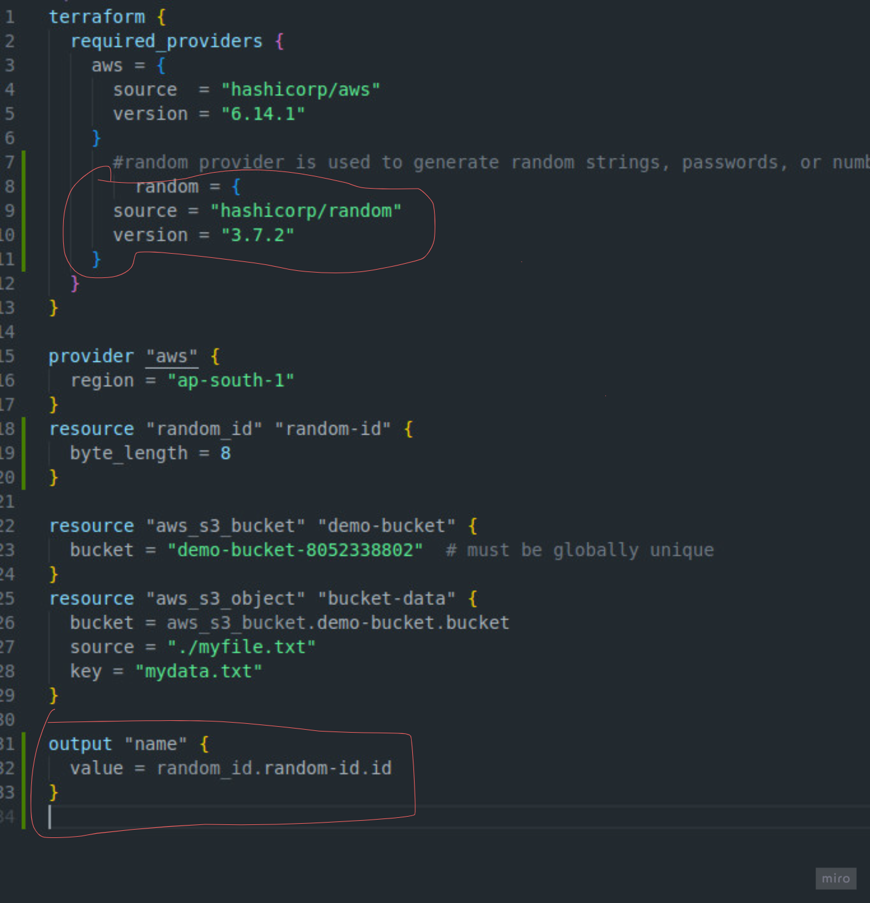

# Terraform Project

This repository contains Terraform code for AWS infrastructure.

## Usage
1. Run `terraform init`
2. Run `terraform plan`
3. Run `terraform apply`

##

  Note ` if you have not default vpc in your aws then run this cammond `

  Run ` aws ec2 create-default-vpc --region ap-south-1 `

   

### 
  If you want to destory  your resouce 
  
  Run `terraform destory `

  

  ## terraform outputs 

     It is for the instance phblic ip 

     output "aws_instance_public_ip" {
    value = aws_instance.myserver.public_ip
  
     }

Note - myserver is the name of resource   ---   ( main.tf )

 ## How to create s3 bucket 

     Note -- source ../.env 
          terraform init 
          terraform validate 
          terraform plan 
          terraform apply   

## Random provider for random id name password name   

     Note - this is the aws provider site

    https://registry.terraform.io/providers/hashicorp/aws/latest/docs

  

  ##  Terraform remote state Management 

## file 
Run ` backend-tf `

   NOTE -  ec2 instance bna ke terraform.tfstate ko  s3 bucket me store krte hai  

Terrafoem ki tf-state vali file remotely s3 ki help se cloud me store krte h  jisse multiple people us file ko access krke kaam  kar sake 
   
   

    Note --  the file name is backend.tf 

   

 # Note -- Terraform.tfstate  me main.tf file ka sara data hota hai  jo bhi hm kaam krte h usme 
   

  ## Live a static website with s3 

    File project Folder name    -  Project-static-website

   Note ` this is the project ` 

   This is output 

  
   
   ##  Folder name - aws-vpc
   Note ` Create a aws-vpc and lunch a aws instance  with same vpc `
   

   ## Set up aws-vpc-ec2 and nginx

  # The code available  

   Folder-name `aws-vpc-ec2-nginx`

   

